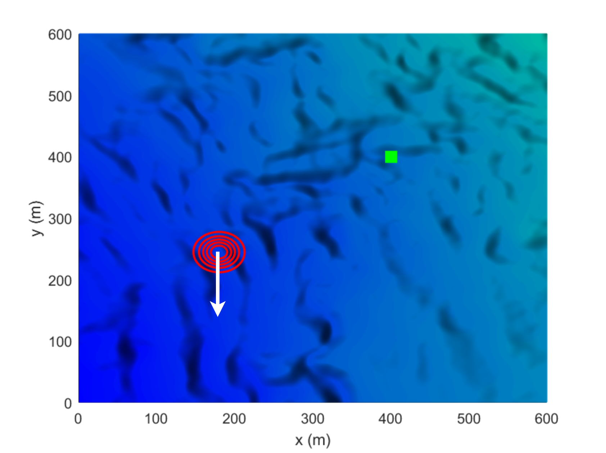
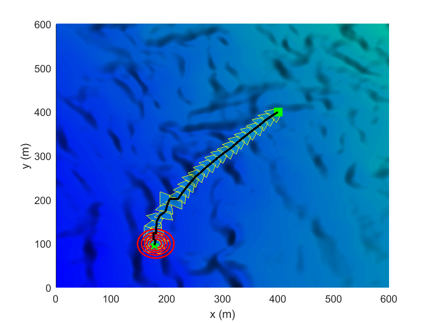

# Polar Coordinate-based Differential Evolution for Moving Target Search Using Vision Sensor on Unmanned Aerial Vehicles

This repository presents the following article in MATLAB:

Thu Hang Khuat, Duy-Nam Bui, Thuy Ngan Duong, Manh Duong Phung,  "**Polar Coordinate-based Differential Evolution for Moving Target Search Using Vision Sensor on Unmanned Aerial Vehicles**", 2025

## Installation
```
git@github.com:thuhangkhuat/PDE_target_search.git
```

## Run simulation
The current version have eight different scenarios, from 1 to 8. Before run each method, please change the value of `model` in file. To run our method:
1. Download all the source files from this repository.
2. Open MATLAB.
3. Execute the main script by running `PDE.m`.

## Visualization

Below are visualizations of the method for Scenario 1:

|  |  |
|:---:|:---:|

<!-- ## Citation
```
@ARTICLE{10964594,
  author={Khuat, Thu Hang and Bui, Duy-Nam and Duong, Thuy Ngan and Phung, Manh Duong},
  journal={Robotics and Autonomous Systems}, 
  title={Polar Coordinate-based Differential Evolution for Moving Target Search Using Vision Sensor on Unmanned Aerial Vehicles}, 
  year={2025},
  volume={},
  number={},
  pages={},
  keywords={Optimal search, unmanned aerial vehicles, differential evolution},
  doi={}}
``` -->